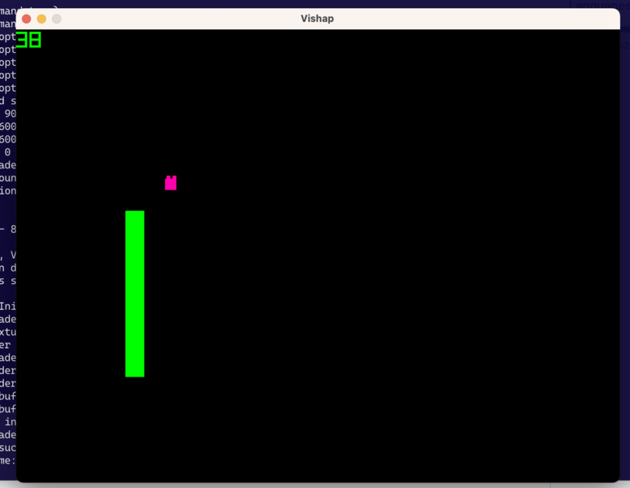

<p align="center">  </p>

## Quick Start
clone the project
```
git clone https://github.com/tmartiro/raylib-window-voc
cd raylib-window-voc
```

VOC compiler build
```
git clone https://github.com/vishaps/voc
make full -C voc
```
Raylib library build
```
git clone --depth=1 https://github.com/raysan5/raylib.git
make -C raylib/src
```

Finally build and run the example program written in Oberon2
```
./build-osx.sh
```


